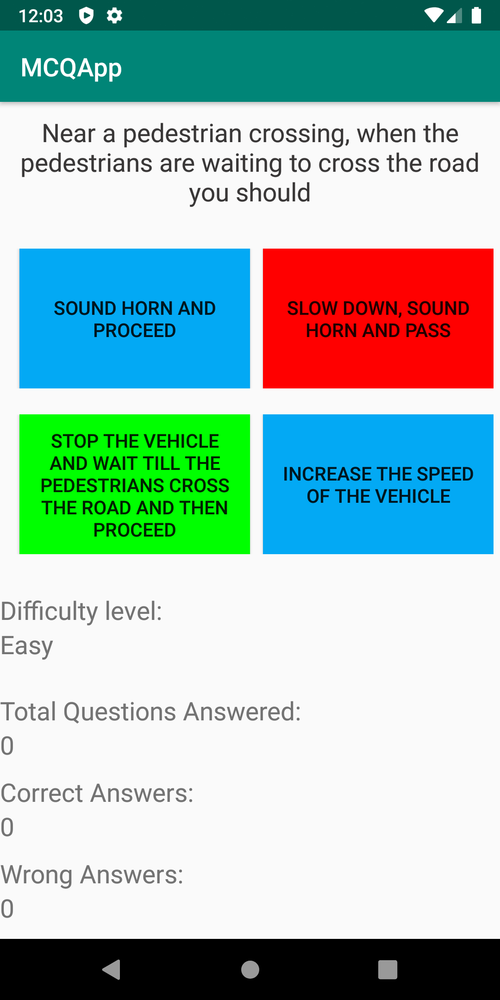
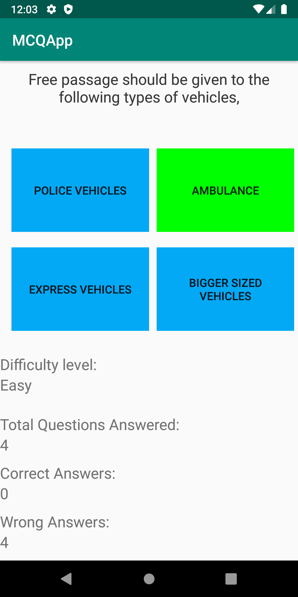
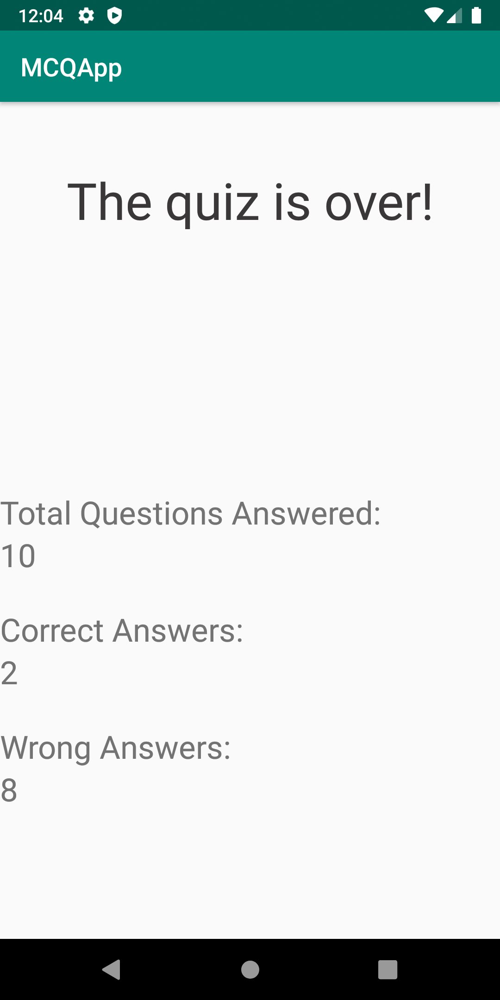

# SE IT Audit Course

## Android app development based on Road safety

### Features of the app

* MCQ App with Google Firebase connectivity to fetch questions from the databse
* Three levels(Easy, Medium and Hard) of difficulty depending on the amount of correct opions selected

## Snippets of the app:

